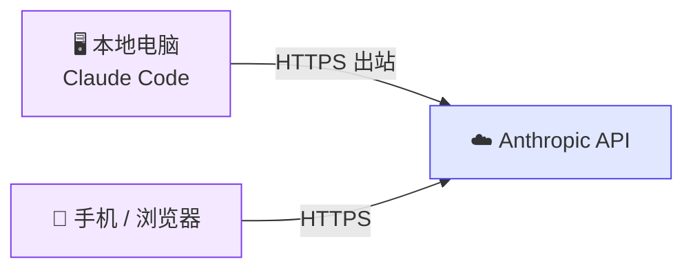

# 9.6 Remote Control 配图 Prompt

以下是文章中需要的图片及对应的 AI 生成 prompt。所有图片保存为 webp 格式，放在 `public/images/chapter-9/` 目录下。

---

## 1. 章节封面题图

**文件名：** `9.6-remote-control.webp`

**Prompt：**

> A clean, modern illustration showing a developer's laptop on a desk with code on screen, connected by glowing wireless signal lines to a smartphone being held by a hand in the foreground. The phone screen shows a terminal-like interface. Background is minimal with soft gradients in purple and blue tones. Flat design style, tech illustration, no text, 16:9 aspect ratio.

---

## 2. 架构示意图

**文件名：** `9.6-architecture.webp`

**Prompt：**

> A minimal technical architecture diagram on white background. Three elements in a horizontal row: (1) a laptop icon labeled "Local Machine / Claude Code" on the left, (2) a cloud icon labeled "Anthropic API" in the center, (3) a smartphone icon labeled "Phone / Browser" on the right. Arrows flow: laptop → cloud (labeled "HTTPS outbound"), cloud ← smartphone (labeled "HTTPS"). A small lock icon on each arrow indicates encryption. Below the laptop, small icons represent: files, terminal, gear (config). Clean line art style, soft purple accent color, no background clutter. 16:9 aspect ratio.

**备选方案：** 也可以用 Mermaid 或 Excalidraw 手动绘制，效果可能更清晰：



---

## 3. 终端启动截图

**文件名：** `9.6-start-server.webp`

**获取方式：** 实际终端截图

**操作步骤：**

```bash
cd ~/projects/your-project
claude remote-control --name "我的重构项目"
```

**截图要点：**
- 截取启动后显示的完整信息（URL、状态、提示文字）
- 终端背景建议用深色主题
- 窗口宽度适中，不要太宽也不要太窄

---

## 4. 终端 QR 码

**文件名：** `9.6-qr-code.webp`

**获取方式：** 实际终端截图

**操作步骤：**

```bash
claude remote-control --name "Demo"
# 启动后按空格键显示 QR 码
```

**截图要点：**
- QR 码完整显示在终端中
- 截图时确保 QR 码清晰可辨

---

## 5. 手机端会话界面

**文件名：** `9.6-mobile-session.webp`

**获取方式：** 手机截图

**操作步骤：**
1. 电脑上启动 `claude remote-control --name "重构用户模块"`
2. 手机上打开 Claude App
3. 进入对应的会话
4. 截图显示对话界面（包含 Claude 正在执行的操作）

**截图要点：**
- 竖屏截图
- 能看到会话名称
- 能看到 Claude 正在执行工具调用或返回结果

**如果无法实际截图，可用 AI 生成替代：**

> A realistic smartphone mockup (iPhone style) showing a chat interface similar to Claude AI app. The screen displays a conversation where an AI assistant is performing code refactoring tasks - showing tool execution results with code snippets. Dark mode UI, purple accent color for the AI messages. The session title at top reads "重构用户模块". Clean, realistic mockup on light gray background. Portrait orientation, 9:16 aspect ratio.

---

## 6. Web 会话列表

**文件名：** `9.6-web-session-list.webp`

**获取方式：** 浏览器截图

**操作步骤：**
1. 电脑上启动 `claude remote-control --name "我的重构项目"`
2. 打开浏览器访问 claude.ai/code
3. 截取会话列表区域，能看到绿色在线标识

**截图要点：**
- 显示至少一个在线会话（绿色圆点）
- 会话名称可见
- 不需要截全屏，截列表区域即可

**如果无法实际截图，可用 AI 生成替代：**

> A browser window screenshot mockup showing a clean session list UI similar to Claude AI's code interface. The list shows 3 sessions: one with a green dot indicator labeled "我的重构项目" (active/online), and two grayed out previous sessions. Minimal design, white background, subtle borders, modern sans-serif font. The URL bar shows "claude.ai/code". 16:9 aspect ratio.

---

## 图片风格统一建议

- **配色：** 以紫色 (#7c3aed) 和蓝色 (#4f46e5) 为主色调，与 Claude 品牌一致
- **风格：** 扁平化插画 + 实际截图混合
- **题图（封面图）：** 使用 AI 生成的插画风
- **操作截图：** 尽量用实际操作的真实截图，更有说服力
- **架构图：** 手绘/工具绘制比 AI 生成更清晰
- **尺寸：** 题图 1200×675 (16:9)，截图保持原始比例，宽度不超过 1200px
- **格式：** 全部转为 webp，质量 80-85%
